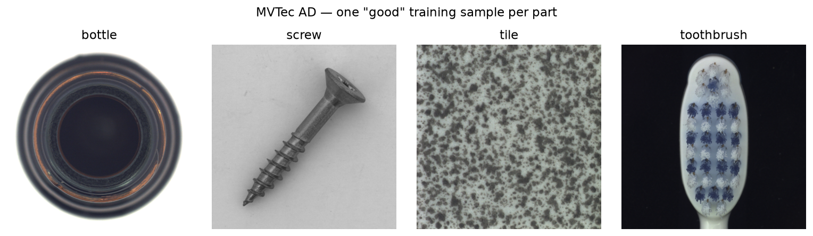
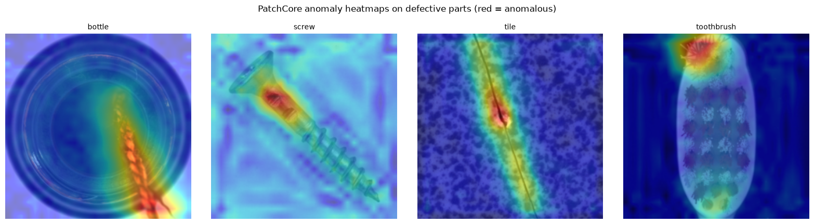

# Visual Inspection PoC — PatchCore Anomaly Detection

Proof-of-concept for automated quality inspection using **PatchCore**, an unsupervised anomaly
detection method. For each part type, the model is trained only on *good* parts — it never
sees a defect during training — and learns to flag anything that deviates from "normal."

## Results

| Metric | Value |
|---|---|
| Parts tested | bottle, screw, tile, toothbrush (MVTec AD) |
| Mean AUROC | **0.971** |
| Success bar | AUROC ≥ 0.85 (all 4 parts passed) |
| Defect examples used in training | 0 |

Per-part precision/recall trade-offs (at each part's 99th-percentile threshold):

- **screw** — recall 0.69, AUROC 0.92. Threshold-free separation is strong; lowering the
  threshold recovers most misses at the cost of a few more false alarms.
- **toothbrush** — precision 0.71. Catches every defect but over-flags some good parts.

AUROC is threshold-free — both trade-offs are a deployment tuning decision, not a model
limitation.


*One "good" training image from each of the four MVTec AD parts.*


*PatchCore anomaly heatmaps on defective MVTec test images (red = anomalous). The hotspot
lands on the real defect in every part: contamination on the bottle, scratched neck of the
screw, crack in the tile, flaw at the toothbrush head.*

## How it works

1. **Describe** — a frozen, pretrained ResNet-18 converts each image into a grid of local
   patch feature vectors (no training of the backbone).
2. **Remember** — every patch from all good training images is stored in a memory bank; a
   greedy-coreset step trims it to a representative subset for fast lookup.
3. **Score** — each patch of a test image is compared to its nearest neighbor in the memory
   bank. The image score = its single most unusual patch.
4. **Decide & localize** — score above threshold → DEFECT, below → GOOD. The same per-patch
   scores double as a heatmap that shows exactly where the anomaly is.

Because scoring is patch-by-patch rather than whole-image, a good part shown at any rotation
or position still matches good patches in the bank — no alignment or fixed pose required.

## Repo structure

```
.
├── anomaly_detection_poc.ipynb   # training, evaluation, AUROC/precision/recall, heatmaps
├── camera_test.ipynb             # live webcam inference loop
├── PoC_Report.docx               # full write-up with results and heatmap figures
├── models/                       # PatchCore memory banks (.npy), one per part
│   ├── bottle_memory_bank.npy
│   ├── screw_memory_bank.npy
│   ├── tile_memory_bank.npy
│   └── toothbrush_memory_bank.npy
├── bottle/ screw/ tile/ toothbrush/   # MVTec AD data (train/good, test/good, test/defect)
```

Each `models/*.npy` file is a NumPy array (~4000 × 384): 4000 representative good-patch
vectors (after coreset subsampling) × 384-dim features from the ResNet-18 layer2+layer3
outputs. There are no trained network weights — this array **is** the model.

## Domain shift consideration

A model calibrated under one imaging setup (e.g. studio conditions — single object filling
the frame, plain background, even lighting) can see its anomaly scores shift if the camera,
lighting, or background changes at inference time. Since the threshold is set relative to the
calibration images, a change in imaging conditions can raise scores across the board, even for
a genuinely good part — a false alarm from domain shift rather than an actual defect.

Two implications for deployment:

- **Heatmaps tend to stay more robust than raw scores** across imaging changes, since they're
  scaled within each image and still localize the most unusual region even when absolute
  scores shift.
- **Scoring one image against multiple part-models isn't a classifier.** Under significant
  domain shift, scores across parts can bunch together — PatchCore only answers "normal vs.
  not" for a given part, not "which part is this."

**Mitigation:** recalibrate the threshold on good images captured under the actual deployment
imaging conditions (same camera, lighting, background as production). Same model, same
method — only the calibration images change.

## Setup

```bash
python3 -m venv venv
source venv/bin/activate
pip install -r requirements.txt   # torch, torchvision, numpy, scikit-learn, opencv-python, etc.
jupyter notebook anomaly_detection_poc.ipynb
```

## Libraries used

- **PyTorch** (`torch`, `torch.nn.functional`) — tensor ops, ResNet-18 backbone
- **torchvision** (`resnet18`, `ResNet18_Weights`, `create_feature_extractor`, `transforms`) —
  pretrained ResNet-18, mid-layer feature extraction, image preprocessing
- **scikit-learn** (`roc_auc_score`, `precision_score`, `recall_score`) — evaluation metrics
- **NumPy** — memory bank storage, nearest-neighbor scoring
- **Pillow (PIL)** — image loading
- **OpenCV (`cv2`)** — webcam capture (`camera_test.ipynb`)
- **Matplotlib** — heatmap and result visualizations
- **IPython** (`clear_output`) — live-updating webcam display

## Citations

**Dataset:**
> Bergmann, P., Batzner, K., Fauser, M., Sattlegger, D., & Steger, C. (2021). The MVTec
> Anomaly Detection Dataset: A Comprehensive Real-World Dataset for Unsupervised Anomaly
> Detection. *International Journal of Computer Vision*, 129, 1038–1059.
> Dataset: https://www.mvtec.com/company/research/datasets/mvtec-ad

**Method:**
> Roth, K., Pemula, L., Zepeda, J., Schölkopf, B., Brox, T., & Gehler, P. (2022). Towards
> Total Recall in Industrial Anomaly Detection. *CVPR 2022*.

**Backbone:**
> He, K., Zhang, X., Ren, S., & Sun, J. (2016). Deep Residual Learning for Image Recognition
> (ResNet). *CVPR 2016*. Pretrained ImageNet weights via `torchvision.models.ResNet18_Weights`.

## Next steps (per team direction)

- Replace/augment MVTec data with real production-camera images
- Test model behavior across lighting/angle/background variations
- Synthetic defect generation to expand training/calibration data
- Extend toward combined **tracking + classification** for parts moving on a line
